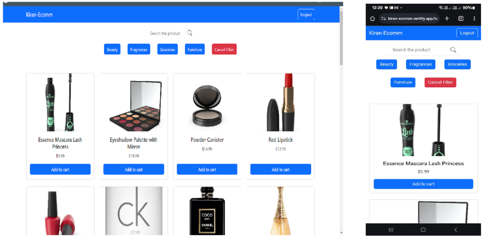

# Kiran-Ecomm Website

This is a simple e-commerce website developed using React. The application includes user authentication (login and signup), API calls, and a category filter and search bar. The website is fully responsive and hosted on Netlify.

**Link to live version - [Kiran-Ecomm](https://kiran-ecomm.netlify.app/)**

<p align="center">

</p>

## Features

- User Authentication:
  - Login
  - Signup with validation
- API Integration for product data
- Category filter
- Search bar for enhanced user experience

## Components

- `Login`: Component for user login
- `SignUp`: Component for user signup with validation
- `Products`: Displays a list of products
- `Header`: Navigation header
- `Home`: Home page

## Future Scope
- Implement cart functionality
- Integrate payment gateway
- Add additional features (e.g., product details, reviews, profile)
- Improve styling and user interface

## Installation

1. Clone the repository:
   ```sh
   git clone https://github.com/KiranKathar06/avaloq-ecomm.git

2. Navigate to the project directory:
    ```sh
   cd avaloq-ecomm

3. Install dependencies:
    ```sh
   npm install

4. Start the development server:
    ```sh
   npm start run

Runs the app in the development mode.\
Open [http://localhost:3000](http://localhost:3000) to view it in your browser.

